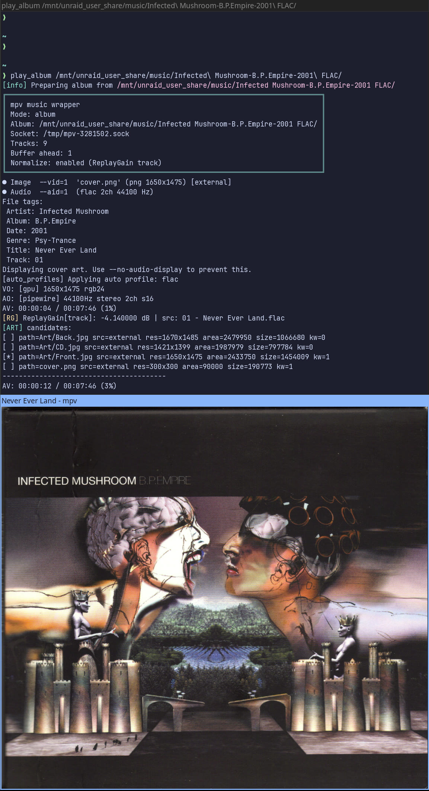

# mpv music wrapper

CLI music player (mpv wrapper) that plays directly from your library with optional on-the-fly per-track ReplayGain (no pre-scan or duplicate ReplayGain library), smart cover-art handling (scans folder/subfolders + embedded, picks best by keyword/resolution), RAM staging (keeps your disks/library untouched), and mpv IPC control (pause/skip/status from other tools). Supports random library shuffle, whole-album playback, and playlist playback from common playlist formats. **The wrapper is now implemented in Python** for portability and fewer dependencies (originally Bash).



## Features
- Modes: random (`--random-mode=full-library --library=...`), album (`--album=DIR`), playlist (`--playlist=FILE`).
- Optional normalization (`--normalize`): copy audio to tmpfs, strip existing ReplayGain tags, add track ReplayGain via metaflac (FLAC only), and start mpv with `--replaygain=track`. This is done on the fly—no advance library scan or maintaining a second ReplayGain’d library. Without it: still copies/strips ReplayGain tags when possible, but no ReplayGain scan and mpv uses `--replaygain=no`.
- RAM staging: per-track subdirs under `/dev/shm/mpv-music-<pid>-XXXXXX`; cleaned as playback advances and on exit. Library is never modified and no disk writes are done during playback.
- Cover art: scans every image in the track folder and all subfolders, extracts embedded art to PNG, selects the best image (front-ish > album-named > everything else, then scope/size), converts to `cover.png`, strips embedded art from the temp audio copy, and exposes only `cover.png` to mpv (`--cover-art-auto=exact`). Album-name matching ignores junk tokens (pure numbers, very short tokens, audio extensions like `flac`/`mp3`).
- IPC/GUI: mpv runs with a GUI window forced open; IPC socket at `/tmp/mpv-<pid>.sock` so you can pause/skip/query status from other terminals/scripts. Poll interval for playlist position is 5s.
- Logging: per-track ReplayGain line and ART candidates, with a separator line after each track. Startup header is auto-sized with mode, path, socket, track count, buffer, and normalize status. Optional `ART_DEBUG=1` for verbose art selection logs.

## Requirements
- python 3
- mpv
- ffprobe and ffmpeg
- metaflac (required when using `--normalize`; otherwise ReplayGain strip/scan is skipped for FLAC)

## Usage
Run from the repository root (or place the script on PATH):

```bash
# Random mode (library required)
./mpv_music_wrapper.py --random-mode=full-library --library=/home/johndoe/music/ --normalize

# Album mode
./mpv_music_wrapper.py --album=/path/to/album --normalize
# Album mode with library (enables parent cover search for multi-disc albums)
./mpv_music_wrapper.py --album=/home/johndoe/music/Album --library=/home/johndoe/music/ --normalize

# Playlist mode
./mpv_music_wrapper.py --playlist=/path/to/list.m3u8 --normalize
```

You can omit `--normalize` to skip ReplayGain scanning (files are still copied/stripped; mpv uses `--replaygain=no`).

Pass additional mpv flags via `--mpv-additional-args="--your --mpv-flags"`.

For album mode, adding `--library=/path/to/your/music` lets the wrapper fall back to album-level cover art (folder directly under the library root) when tracks live in disc subfolders.

### Examples for shell functions / aliases
Add to `~/.bashrc` (adjust paths as needed):
```bash
play_random_music(){ ./mpv_music_wrapper.py --random-mode=full-library --library=/home/johndoe/music/ --normalize; }
play_album(){ ./mpv_music_wrapper.py --album="$1" --library=/home/johndoe/music/ --normalize; }
```

Then use:
```bash
play_random_music
play_album /path/to/album
```

## Cover selection details
- Where it searches:
  - Track folder and its subfolders.
  - Embedded art (extracted to PNG).
  - With `--library` in album or random mode for multi-disc layouts: also the album’s top folder.
- Tokens and keywords:
  - Preferred keywords: `cover`, `front`, `folder` (change via `PREFERRED_IMAGE_KEYWORDS`).
  - Non-front words: `back`, `tray`, `cd`, `disc`, `inlay`, `inlet`, `booklet`, `book`, `spine`, `rear`, `inside`, `tracklisting`.
  - Album-name tokens: album folder name is normalized (lowercase, punctuation stripped) and drops audio extensions, pure numbers, and very short tokens. Image basenames are normalized the same way; shared tokens give an album-name score.
- Buckets (priority order):
  1) Front-ish: has a preferred keyword, or has album-name tokens with no non-front words.
  2) Album-named with non-front words.
  3) Everything else.
- Picking inside a bucket:
  - Scope: disc/embedded > album-root > other, with an area override (`AREA_THRESHOLD_PCT`, default 75%).
  - Then resolution/area, then keyword index, then file size, then filename. Album-name token count breaks ties inside album-named buckets.
- Overrides:
  - A high-res album-named image (no non-front words) can beat a much smaller keyworded image if its area is within `AREA_THRESHOLD_PCT`.
  - Between keyworded images of similar size, one with non-front words loses to one without them (uses the same area threshold).
- Embedded art: extracted and compared like externals; if it loses, it’s removed. The winner is exposed as `cover.png` in the track’s temp dir, and embedded art is stripped from the temp audio copy so mpv only sees `cover.png`.

## Random algorithm
- Current random mode is `full-library`. Libraries with <50 albums shuffle all tracks once (uniform, no replacement).
- Libraries with ≥50 albums use album-spread: build an album → tracks map, pick a random album not seen in the recent history window, then a random track from that album. The history size is ~10% of album count, clamped to 20–200 and never reaching the full album count.
- Recently played albums are avoided until they age out of the history window; playback continues indefinitely with albums rotating back in after they fall out of history.
- The library is fully rescanned every hour and the album/track pool is rebuilt (recent-album history is kept, entries for deleted albums are dropped). Newly added albums can start playing without restarting the script.
- Tunables live near the top of `mpv_music_wrapper.py` (e.g., album thresholds, history percent/min/max, rescan interval).
## Playlists
- Supported: m3u/m3u8/pls/cue. Non-audio entries are skipped with warnings. Relative paths are resolved against the playlist location.

## Behavior and safety
- Library is read-only; all processing occurs on temp copies in RAM (`/dev/shm/mpv-music-<pid>-XXXXXX` when available; override with `MPV_MUSIC_TMPDIR`).
- Per-track temps are cleaned as playback advances; everything is cleaned on exit.
- IPC socket: `/tmp/mpv-<pid>.sock`.
- Poll interval: 5 seconds.

## Controlling mpv via IPC helper
`mpv_send_key.py` sends simple controls to any mpv IPC socket (default glob `/tmp/mpv-*`, filters to real sockets):

```bash
./mpv_send_key.py pause      # toggle pause
./mpv_send_key.py next       # playlist next (weak)
./mpv_send_key.py prev       # playlist prev (weak)

# Target a specific socket (or glob)
./mpv_send_key.py pause '/tmp/mpv-music-*'

# Debug (shows sockets found/errors)
MPV_SEND_DEBUG=1 ./mpv_send_key.py pause
```

You can bind these commands to global hotkeys in your desktop environment/window manager (e.g., map Pause/Play/PgUp/PgDn keys to run `./mpv_send_key.py pause|next|prev`).

## Debugging
- Set `ART_DEBUG=1` to print detailed art candidate selection, stored cover meta, and track separators.

## Development and tests
See `tests/DEV.md` for dev/test setup (pytest, helper scripts). Runtime usage doesn’t require any of that.
